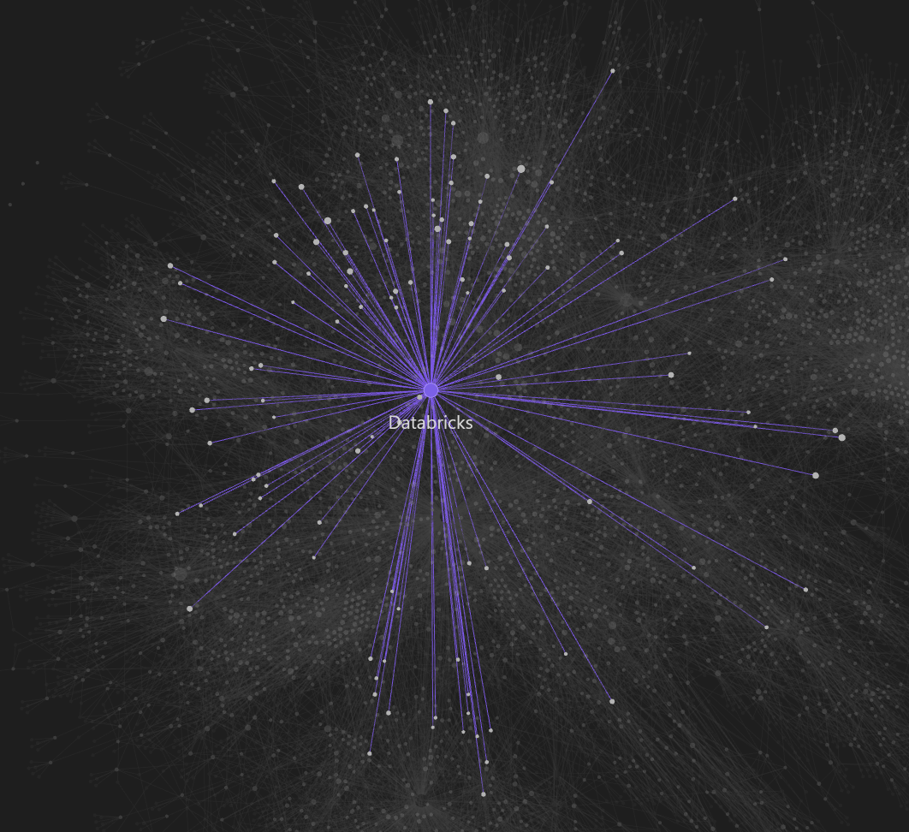

# Databricks Knowledge Base — OKF Format

A structured knowledge base in **OKF (Open Knowledge Format)** covering Databricks features, best practices, and architecture patterns. 5,000+ concepts, all linked, all machine-readable.

## What This Is

- **OKF at scale** — 5,000+ concepts organized, linked, and ready to use
- **LLM-ready** — structured wikilinks enable semantic navigation; ship the `dbokf-mcp` server and any MCP client can query it immediately
- **Obsidian-native** — drop the `/concepts/` folder into Obsidian for graph view, backlinks, and full-text search out of the box
- **Real-world content** — Databricks AWS documentation: ABAC, Delta Lake, MLflow, Unity Catalog, distributed training, serverless compute, and more



## Quick Start

### Browse in Obsidian

1. Download [Obsidian](https://obsidian.md)
2. File → Open folder as vault → select this git repo root
3. Graph view, backlinks, and local graphs work immediately — no plugins needed

Open `/index.md` for the full concept catalog.

## `dbokf-mcp` — MCP Server

This repo ships a production-ready MCP server that exposes the knowledge base as semantic search tools to any MCP client (Claude Desktop, Claude Code, etc.).

### How It Works

```
concepts/*.md  ──[index]──▶  dbokf-index/vectors.bin   (Float32 embeddings)
                              dbokf-index/meta.json      (title, tags, description)
                              dbokf-index/config.json    (model name + dim)
                                    │
                            ┌───────▼────────┐
                            │  dbokf-mcp     │  Node.js · stdio MCP
                            │  server        │
                            └───────┬────────┘
                                    │ JSON-RPC
                         Claude / any MCP client
```

1. **Index once** — `dbokf-mcp index` embeds all concepts via your chosen model and writes a binary Float32 index to disk. The model name and dimension are stored in `config.json`.
2. **Serve fast** — `dbokf-mcp server` loads the index into memory at startup (sub-second) and ranks queries by cosine similarity in pure JS. No external DB.

### Setup

```bash
npm install -g dbokf-mcp

export LLM_KEY=sk-or-...
export LLM_BASE_URL=https://openrouter.ai/api/v1
export LLM_EMBEDDING_MODEL=perplexity/pplx-embed-v1-0.6b

dbokf-mcp index --okf-dir /path/to/this/repo
```

> Tested with `perplexity/pplx-embed-v1-0.6b` via OpenRouter. Any OpenAI-compatible embedding endpoint works.

### Wire Up Claude

Add to `claude_desktop_config.json` or `.claude/settings.json`:

```json
{
  "mcpServers": {
    "databricks-okf": {
      "command": "node",
      "args": [
        "..\\databricks-okf\\dbokf-mcp\\dist\\cli.js",
        "server",
        "--okf-dir",
        "..\\databricks-okf\\"
      ],
      "env": {
        "LLM_KEY": "sk-or-...",
        "LLM_BASE_URL": "https://openrouter.ai/api/v1",
        "LLM_EMBEDDING_MODEL": "perplexity/pplx-embed-v1-0.6b"
      }
    }
  }
}
```

### Tools

| Tool | Description |
|------|-------------|
| `search_concepts(query, k=5)` | Semantic search over all 6,000+ concepts |
| `fetch_concept(id)` | Get full markdown for a concept by ID |
| `search_by_tags(tags, limit=10)` | Filter concepts where all tags match |
| `list_tags()` | List all available tags |

### Commands

```
dbokf-mcp index   [--okf-dir <path>] [--batch-size <n>]
dbokf-mcp server  [--okf-dir <path>]
dbokf-mcp help
```

### Environment Variables

| Variable | Required | Description |
|----------|----------|-------------|
| `LLM_KEY` | yes | API key |
| `LLM_BASE_URL` | no | API endpoint (default: OpenAI) |
| `LLM_EMBEDDING_MODEL` | no | Embedding model (default: `text-embedding-3-small`) |

`LLM_EMBEDDING_MODEL` only needs to be set at index time — the model is stored in `dbokf-index/config.json` and reused automatically by the server.

### Technical Details

- **Storage**: binary `Float32Array` (`vectors.bin`) + JSON metadata — computed once, loaded once per server start
- **Search**: cosine similarity in vanilla JS, no native dependencies
- **Transport**: stdio — works with Claude Code, Claude Desktop, and any MCP-compatible client
- **Node.js** >= 18 required

## Structure

```
/concepts/        6,000+ OKF markdown files
/index.md         Full concept catalog
/dbokf-mcp/       MCP server (Node.js/TypeScript)
/dbokf-index/     Generated embedding index (created by dbokf-mcp index)
/README.md        This file
```

## Format

Each concept is a standalone markdown file with OKF frontmatter:

```yaml
---
title: ABAC (Attribute-Based Access Control)
description: An access-control model in Unity Catalog that uses governed tags...
tags:
  - access-control
  - unity-catalog
---
```

Concepts link to each other with `[[wikilinks]]` — navigate bidirectionally in Obsidian or follow chains programmatically.

## Why OKF

OKF (Open Knowledge Format) is a [vendor-neutral open specification](https://cloud.google.com/blog/products/data-analytics/how-the-open-knowledge-format-can-improve-data-sharing) announced by Google Cloud (June 2026) that formalizes a pattern Andrej Karpathy articulated in his [LLM Wiki gist](https://gist.github.com/karpathy/442a6bf555914893e9891c11519de94f): instead of retrieving from raw documents at query time, an LLM *compiles* a persistent, interlinked wiki — updating it as new sources arrive, maintaining cross-references, resolving contradictions. The knowledge is compiled once and kept current, not re-derived on every query.

> "LLMs don't get bored, don't forget to update a cross-reference, and can touch 15 files in one pass."
> — Andrej Karpathy

The [OKF v0.1 spec](https://github.com/GoogleCloudPlatform/knowledge-catalog/blob/main/okf/SPEC.md) pins down exactly the minimum conventions needed for interoperability:

- **One file = one concept** — the file path is the concept's identity
- **YAML frontmatter** — `type`, `title`, `description`, `tags` — nothing else required
- **Plain markdown body** — structure over prose; fenced code blocks and tables over freeform text
- **Wikilinks as edges** — cross-references create a navigable knowledge graph

The format's design principles:

- **Readable without tooling** — `cat` a file, `git clone` a repo, you're done
- **Diffable in version control** — knowledge evolves transparently
- **Producer/consumer independence** — a human-authored bundle, an LLM-generated catalog, and a BigQuery export pipeline all speak the same format; any agent can consume any of them without translation
- **Format, not platform** — no required cloud, no SDK, no proprietary account; value comes from how many parties speak it

This repo is a concrete example of the pattern: 5,000+ Databricks concepts compiled from AWS documentation by [llm-wiki-compiler](https://github.com/atomicstrata/llm-wiki-compiler), stored as OKF, queryable via a local MCP server, and browsable in Obsidian — all from the same flat directory of markdown files.

## Acknowledgments

This knowledge base was compiled using [llm-wiki-compiler](https://github.com/atomicstrata/llm-wiki-compiler) and several iterations and adjustments to the result.

## License

Apache 2.0
